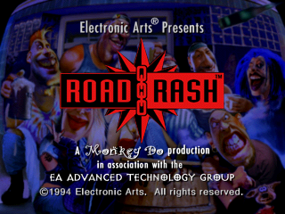

# Road Rash for 3DO

<p align="center">
  
</p>

This is a decompilation and reconstruction of Road Rash (USA) for the
3DO as part of the [3DO Decomp
Project](https://www.patreon.com/trapexit/posts/announcing-3do-164834756). The
intent is not to provide a byte-for-byte build of the original
executable but a functional reconstructed codebase targeting the [3DO
DevKit](https://github.com/trapexit/3do-devkit) and usable as a
starting point for enhancements on the 3DO and ports to other
platforms.


## Enhancements

* BannerScreen


## Optimizations

The reconstructed C runtime has been tuned to reduce ARM60 instruction
count, memory traffic, repeated resource walks, and operating-system
calls. Each entry below describes what the original code did on that
path, what this tree does instead, and why that is cheaper. The list
covers the notable optimizations, not every reconstruction or bug fix.


### CEL and road rendering

* **Selective inlining.** Small shading, validation, projection, road geometry,
  strip-selection, and simulation helpers that the original calls from hot loops
  are inlined. This removes call/return overhead and lets intermediate values
  stay in registers across the former call boundary. Inlining was measured
  rather than applied indiscriminately: candidates that increased per-call cost
  were rejected.
* **Cheaper CEL dimension selection.** The original walks its sorted threshold
  tables backward, one entry at a time; the reconstruction bisects them, which
  needs a logarithmic number of comparisons instead of a scan. Single-entry
  tables bypass dimension normalization; four-entry tables use a fixed
  two-comparison decision tree. Grid selection reads its header fields once and
  skips logarithm lookups for dimensions already beyond the lookup range,
  avoiding repeated header reads and unconditional logarithms. CCB flags are
  loaded once before updating the selected payload. These changes add no
  persistent selection cache.
* **Less packet memory traffic.** Quad coordinates are held in locals while
  computing mappings, rather than repeatedly loaded through pointers that may
  alias the output packet, so stores to the packet cannot force a reload of
  values already computed. Roadside fills likewise construct their quads from
  locals. CEL appenders read the packet cursor once on the normal path, compose
  header flags in one write, and store the final shaded PIXC value once instead
  of copying and then overwriting it.
* **Work moved outside strip and particle loops.** Road surface CEL tables are
  selected once per side rather than once per strip, with a direct loop for the
  common style/variant table and the general path retained for other surface
  modes. The particle renderer loads its reciprocal-table pointer once per frame
  rather than per particle.
* **Direct static-roadside rendering.** Static objects no longer need the
  cleared temporary repeated-object record, copied collision bounds, and
  copy-back after rendering that the original performed. Static and repeated
  entry points specialize a shared renderer that accesses the actual records.
  Road sides also carry their texture-binding state directly, avoiding repeated
  pool-index recovery.
* **Fewer spilled values in renderer loops.** The roadside collision scan reads
  the placed record through a pointer instead of copying its bounds into a
  local, so each box edge's live range ends at its own comparison instead of
  spanning two helper calls. The two profile-band point helpers write through
  an out-pointer instead of returning a `RoadPoint` by value, removing the
  hidden return temporary and the copy that followed it. Road surface strips
  resolve the style row once before the strip loop instead of re-deriving it
  per strip behind a first-strip test. The strip subdivision loops apply their
  edge bias to locals and store the projected quad once, instead of loading
  each field back through the address-taken quad to adjust and re-store it. The
  particle renderer names the two shared y values rather than reading them back
  out of the quad. Shortening these live ranges keeps APCS callee-saved
  registers from spilling to the stack, which is uncached memory on the ARM60.

### Animation decoding and resource reuse

* **Cache stable roadside animation results.** Family CANS roots are validated
  once for a stable selector, animation pointer, and family generation, where
  the original revalidated and re-decoded on every roadside request. An
  unchanged roadside binding reuses its decoded CCB after refreshing the source
  pointer. Resource generation changes invalidate both paths, preserving
  validation when streamed family storage is reused.
* **Reuse validated frame walks.** CANS decoding remembers already validated
  pixel-chunk positions, so a request does not repeat the walk from frame zero
  that the original performed. The bounded cache is keyed by animation pointer,
  loaded extent, and family resource generation, so a reload invalidates the
  entry. This supplements the generation-aware root-validation cache; it does
  not remove bounds checking for newly encountered chunks.
* **Avoid duplicate initialization and validation.** Normal CANS frame output
  is cleared with direct field stores, including hotspot storage, and the
  channel wrapper no longer clears the same output again before a normal
  decode. Invalid inputs and metadata-only requests retain their required
  clearing. An identical second chunk-bounds check was removed from the metadata
  walk, while the first validation remains.
* **Reuse the cached CANS root validation on the racer path.** Racer auxiliary
  animations were validated with the uncached walk of the whole chunk stream on
  every rendered frame. They now use the generation-keyed variant the roadside
  path already used, which answers from a probe and falls back to the walk when
  the family generation is unknown.

### Simulation and fixed-point arithmetic

* **Cheaper software division.** Signed and unsigned division skip blocks of
  quotient bits known to be zero and handle trivial divisors directly, instead
  of producing every quotient bit. Frequent rider timesteps of 1, 2, 4, and 8
  use dedicated quotient paths; other values retain the general divider. These
  paths preserve the legacy rounding and exceptional-value behavior rather than
  substituting ordinary C division.
* **Specialized constant arithmetic.** Lane-index calculations use an exact
  reciprocal fast path for division by the fixed lane spacing, with the general
  divider retained outside its valid range, so the common case avoids the
  divider call entirely. Road texture-cache indexing uses folding and reciprocal
  arithmetic for the fixed 33-node ring, sharing the result between left and
  right sides.
* **One-multiply table interpolation.** Fixed-point sine/cosine and vector-angle
  interpolation use a shifted table value plus one multiply of the difference,
  replacing two multiplies while retaining 32-bit wrapping behavior.
* **Fewer list writes and collision candidates.** Race schedule sorting finds
  an out-of-order object's insertion point and relinks it once instead of
  repeatedly swapping adjacent nodes. Collision scanning stops beyond a
  validated longitudinal bound; it falls back to the full scan when ordering,
  extents, or collision callbacks make that bound unsafe. Surface-zone
  classification is also computed once and shared across the rider traction and
  forward-velocity updates instead of being recalculated.

### Audio, HUD, and memory

* **Skip unchanged DSP knob writes.** Voice frequency/amplitude and submixer
  left/right gain updates remember successfully applied values and avoid the
  redundant `TweakRawKnob`/`TweakKnob` calls the original issues on every
  update. Validity is reset with the relevant voice or knob lifecycle; failed
  writes do not become valid cache hits. Frequency scaling still runs before
  comparing the effective DSP value.
* **Combine MIDI deadline scans.** The post-dispatch track scan now finds both
  the next track event and active-note release deadline, eliminating the
  separate `OMS_GetNextNoteOffTime` pass the original ran.
* **Reuse HUD formatting and avoid redundant palette stores.** Speed, progress,
  and race-position readouts retain their formatted text until the displayed
  value changes, skipping the reformatting the original repeated every frame,
  while still restoring the shared text buffer for drawing. Font palette entries
  are composed before writing and compared against the actual resource bytes,
  avoiding unnecessary stores without trusting stale font-color metadata.
* **Reduce allocator and stream-buffer work.** Block relocation uses
  overlap-safe directional word/byte copies instead of the general `memmove`
  path. Resizing returns alignment and minimum-payload slack to the heap's free
  byte accounting, and compaction coalesces free blocks on its first pass and
  after successful moves rather than after every unsuccessful candidate.
  Synchronous movie buffering was reduced from ten to nine 48-KiB blocks,
  saving 48 KiB of stream data storage. Silent previews use five blocks;
  background music retains its ten-block request.
* **Pack auxiliary cache identities.** Keeping eight-bit selectors separate
  from aligned generation counters avoids 408 bytes of padding in the 68-by-2
  racer auxiliary animation binding table.

### Build and runtime overhead

The build adopted the no-frame-pointer APCS variant, freeing `r11` for ordinary
register allocation. Release builds retain `-O2` and disable compiler-generated
stack-limit checks with `-zpno_check_stack`. This reduces prologue overhead,
but stack exhaustion is no longer detected and can corrupt memory; omitting
the frame pointer also removes the conventional frame-chain backtrace.

Boot traces, per-frame diagnostic hooks, debug camera controls, and memory-map
dumps were removed. Required allocator synchronization and on-screen
startup/movie error reporting remain. This reduces diagnostic overhead and code
size without treating error handling as disposable.


## Download

As I do not hold the copyright for the game or assets I'm not in a
position to upload a complete ISO. However, I do have
[xdelta3](https://github.com/jmacd/xdelta) patch files available.

Find the files on the [Releases page](releases/)

You will need a copy of Road Rash (USA):

* ISO md5sum: `ebb3dee3ebcaef3fbe4fb1401347f1ed`
* BIN md5sum: `9eb8826af01d4f8d3b735c8bf1fd01ea`

If you have a `.bin` file you can convert it to an ISO with 3dt: 

`3dt to-iso "Road Rash (USA).bin"`


### Apply Patch

```
xdelta3 -d -s "Road Rash (USA).iso" road_rash_v1.0.xdelta "Road Rash v1.0.iso"
```

If you want a GUI to apply the patch you can use [Delta
Patcher](https://github.com/marco-calautti/DeltaPatcher).


### Create Patch

```
xdelta3 -9 -S lzma -B1073741824 -e -s "Road Rash (USA).iso" iso/road_rash.iso road_rash_v1.0.xdelta
```


## Building

As it targets the [3DO DevKit](https://github.com/trapexit/3do-devkit)
it works the same as other 3DO Devkit projects.

1. Dump your copy of Road Rash (USA) for the 3DO. The md5sum of the
   ISO should be `ebb3dee3ebcaef3fbe4fb1401347f1ed`.
1. Download the devkit from https://github.com/trapexit/3do-devkit
2. Download this repo
2. Activate the devkit environment
3. `3dt unpack --only-assets "Road Rash (USA).iso" -o takeme`
4. Run `make`

This will build the code, link the executable into `takeme/LaunchMe`
and build the iso at `iso/road_rash.iso`.


## Reporting Issues

This project, like all the [3DO Decomp
Project](https://www.patreon.com/trapexit/posts/announcing-3do-164834756)
reconstructions, was automated using custom tooling and AI to do a
bulk of the manual decompilation and reconstruction. Byte-for-byte
accuracy is not practical due to 3DO games regularly using different
static libraries, operating system versions, compilers, and
SDKs. Functional equivalence targeting the modern [3DO
DevKit](https://github.com/trapexit/3do-devkit) allows for ease of
maintenance but also means bugs can creep in more easily. If you find
any bugs please file a ticket on the
[issues](https://github.com/trapexit/3do-decomp-road-rash/issues)
page. Please include as much information as you can including
screenshots, platform (real hardware or emulator), etc.


## References

* https://www.patreon.com/trapexit/posts/announcing-3do-164834756
* https://www.twitch.tv/3dodev
* https://3dodev.com
* https://github.com/trapexit/3do-devkit


## Donations / Sponsorship

If you find the work I'm doing valuable please consider supporting its
ongoing development.

https://github.com/trapexit/support
